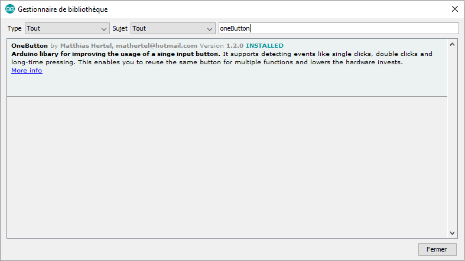
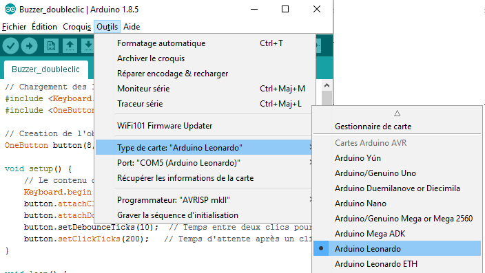

# Introduction :

Cette version utilise une carte Arduino Leonardo. Celle ci étant plus grande que la carte ProMicro qui équipe la version originale de alt0183, le boitier imprimable en 3D n'est pas utilisable ici. Cette version est intéressante si vous avez déjà une carte Leonardo et que vous ne souhaitez pas en acheter une autre.

## Liste du matériel :
* Arduino Leonardo
* deux fils de cablage
* un interrupteur

Vous aurez également besoin des équipements suivants :
* fer à souder
* une imprimante 3D

## Fabrication et assemblage du boutton

Dans la version originale le buzzer a été imprimé en 3D en utilisant le fichier [Knopf.STL](https://www.thingiverse.com/thing:1406545/#files) proposé par [MaxWinterstein](https://www.thingiverse.com/MaxWinterstein/about) mais vous pouvez tout à fait le remplacer par une demi sphère en mousse ou polystirène.

Le montage s'assemble comme celà :

Percer la boite :

Peindre ou recouvrir l'extérieur de la boite :

## Soudage du bouton :

Brancher le bouton (ici, les cables ont été soudés sur le bouton) :

## Montage du bouton dans le boitier

Visser le bouton dans la boite :

Tout mettre dans la boite et refermer !

Voilà !

Positionner l'arduino dans la boite et la refermer.

# Programmation :
A cette étape, vous pouvez brancher l'arduino à votre ordinateur

## Installer le Logiciel arduino
Pour programmer votre carte Arduino vous aurez besoin d'installer le logiciel disponible sur la [page téléchargement du site Arduino](https://www.arduino.cc/en/Main/Software).

## Installation des librairies nécessaires à ce projet
Les librairies apportent des fonctions supplémentaires à Arduino. Dans ce projet, nous allons utiliser les librairies suivantes :
* Keyboard qui permet à la carte Arduino d'envoyer des signaux correspondant à des touches claviers
* oneButton qui permet de détecter un double clic

## Code

Dans la fenètre du logiciel Arduino, copiez le code disponible [sur ce lien](Alt0183_Leonardo.ino)

Votre fenêtre doit maintenance ressembler à cela :

Sauvegarez le fichier

## Téléverser le code sur la carte Arduino

La dernière étape consiste à envoyer ce code sur la carte Arduino. Pour celà :

* Sélectionnez le type de carte que vous utilisez dans le menu approprié :

* Dans le menu "port" sélectionnez le seul disponible (le numéro derrière COM peut varier, ce n'est pas important)

Cliquez sur le bouton téléverser en forme de flèche pour envoyer le script sur l'Arduino :

Si la partie noire en bas de la fenètre ne renvoie que du texte écrit en blanc et pas d'erreur (écrites en orange), le script est bien chargé sur l'Arduino :

Voilà! Enjoy!

### En cas de problème :

Allez dans l'onglet "Issues" de ce site et décrivez votre problème. Nous ferons notre possible pour vous répondre au plus vite.
