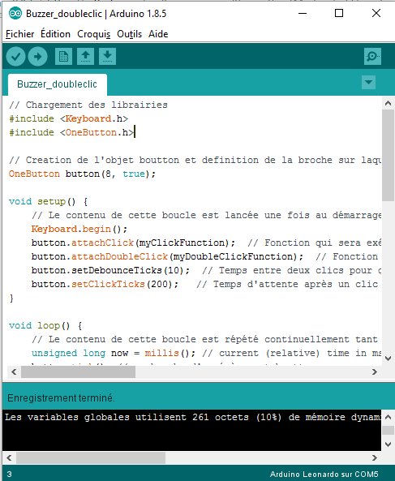

# Introduction :

Cette version est la plus simple à réaliser. La liste du matériel est fournie et les fichiers à imprimer en 3D également.

## Liste du matériel :
* Arduino Pro Micro
* deux fils de cablage
* un interrupteur

Vous aurez également besoin des équipements suivants :
* fer à souder
* imprimante 3D

Si vous ne disposez pas de ces outils, nous vous conseillons de prendre contact avec un fablab près de chez vous.

# Impression 3D du boitier :
Téléchargez les fichiers STL :
* [Dessous](CAO/STL/Dessous.stl)
* [Dessus](CAO/STL/dessus.stl)
* [Buzzer](CAO/STL/buzzer.stl)

Imprimez les en 3D. Dans notre cas, nous avons choisi d'imprimer le boitier en jaune et le buzzer en rouge mais libre à vous de choisir le filament de votre choix.

# Fabrication et assemblage du boutton

## Soudage du bouton :

## Montage du bouton dans le boitier

Visser le bouton dans le boitier :

Brancher le bouton (ici, les cables ont été soudés sur le bouton) :

Positionner l'arduino dans la boite et la refermer.

# Programmation :
A cette étape, vous pouvez brancher l'arduino à votre ordinateur

## Installer le Logiciel arduino
Pour programmer votre carte Arduino vous aurez besoin d'installer le logiciel disponible sur la [page téléchargement du site Arduino](https://www.arduino.cc/en/Main/Software).

## Installation des librairies nécessaires à ce projet
Les librairies apportent des fonctions supplémentaires à Arduino. Dans ce projet, nous allons utiliser les librairies suivantes :
* Keyboard qui permet à la carte Arduino d'envoyer des signaux correspondant à des touches claviers
* oneButton qui permet de détecter un double clic

## Code

Dans la fenètre du logiciel Arduino, copiez le code disponible [sur ce lien](Alt0183_ProMicro.ino)

Votre fenêtre doit maintenance ressembler à cela :

Sauvegarez le fichier

## Téléverser le code sur la carte Arduino

La dernière étape consiste à envoyer ce code sur la carte Arduino. Pour celà :

* Sélectionnez le type de carte que vous utilisez dans le menu approprié :

* Dans le menu "port" sélectionnez le seul disponible (le numéro derrière COM peut varier, ce n'est pas important)

Cliquez sur le bouton téléverser en forme de flèche pour envoyer le script sur l'Arduino :

Si la partie noire en bas de la fenètre ne renvoie que du texte écrit en blanc et pas d'erreur (écrites en orange), le script est bien chargé sur l'Arduino :

Voilà! Enjoy!

### En cas de problème :

Allez dans l'onglet "Issues" de ce site et décrivez votre problème. Nous ferons notre possible pour vous répondre au plus vite.
