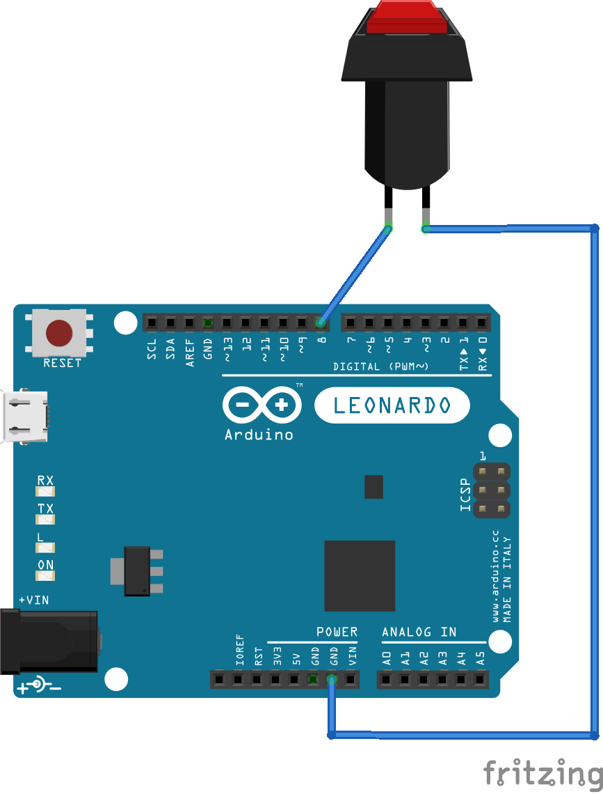
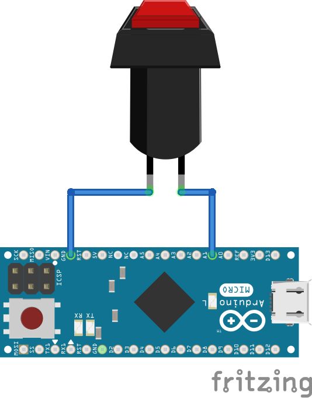
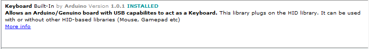
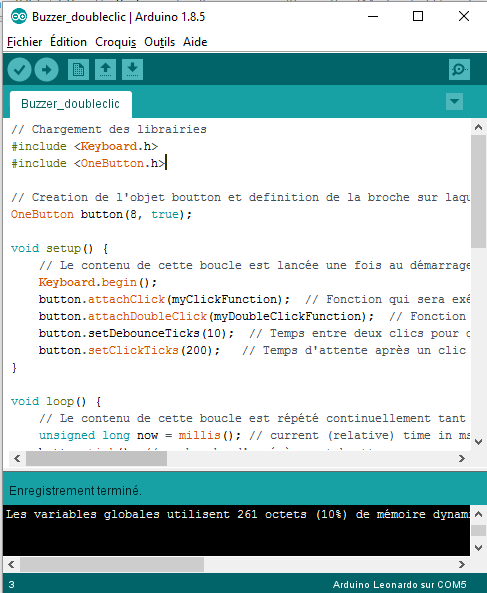
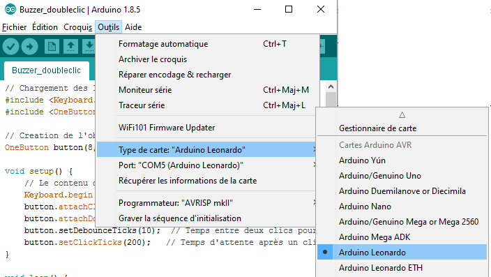

# Comment fabriquer un bouton Alt0183

## Description
Le Buzzer point médian a pour fonction de créer un raccourci physique et tangible vers le caractère point médian difficile d'accès sur les claviers Windows.
Cet objet peut prendre toute forme selon les choix de la personne qui le réalise. Dans sa version initiale, le coté volontairement voyant de l'objet a pour but de susciter l'intérêt et le questionnement des personnes environnantes afin de permettre d'initier un débat autour de l'écriture inclusive.
Ce projet a été réalisé lors du Hackathon Ecriture Inclusive organisé a Simplon.co et soutenu par ...

Le buzzer se connecte au port USB d'un ordinateur et agit comme un clavier externe qui ne renvoit que le caractère point-médian.

## Réalisation de l'objet physique :

### Liste du matériel :
* Arduino Léonardo ou Léonardo pro (l'important est que le microcontroleur soit un ATMEGA32u4)
* une boite
* deux fils de cablage
* un interrupteur
* un "buzzer" imprimé en 3D ou réalisé en mousse

Ces équipements peuvent permettrent de faciliter la réalisation de cet objet :
* fer à souder 
* imprimante 3D

### Cablage :
Cablage du bouton sur l'Arduino Leonardo :

Cablage du bouton sur l'Arduino Leonardo Pro Mini :

## Programmation 

### Logiciel arduino
Pour programmer votre carte Arduino vous aurez besoin d'installer le logiciel disponible sur la [page téléchargement du site Arduino](https://www.arduino.cc/en/Main/Software).

### Installer les librairies 
Les librairies utilisées sont :
* Keyboard qui permet à la carte Arduino d'envoyer des signaux correspondant à des touches claviers
* oneButton qui simplifie l'usage du double clic

### Code
Dans la fenètre d'arduino, copiez le code disponible [sur ce lien](Arduino/Buzzer/Buzzer.ino)

Votre fenètre doit ressembler à cela :

### Téléverser le code sur la carte Arduino 

Branchez votre carte Arduino au port USB de votre ordinateur

Sélectionnez le type de carte que vous utilisez dans le menu approprié :

Dans le menu "port" sélectionnez le seul disponible (le numéro derrière COM peut varier, ce n'est pas important)

Cliquez sur le bouton téléverser en forme de flèche pour envoyer le script sur l'Arduino :

Si la partie noire en bas de la fenètre ne renvoie que du texte écrit en blanc et pas d'erreur (écrites en orange), le script est bien chargé sur l'Arduino : 

## Fabrication et assemblage du boutton

